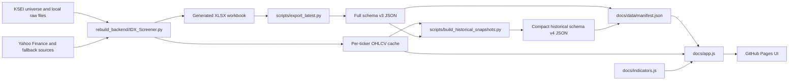

# System Architecture

## Overview

IDX RESEARCH is a static GitHub Pages application. Python generates Excel and JSON artifacts; the browser reads committed JSON and renders the interface without an application server or database.

## Ownership By File

| Area | Primary files | Responsibility |
|---|---|---|
| Calculation source | `rebuild_backend/IDX_Screener.py` | Market cutoff, data fetch, indicators, signals, workbook creation |
| Original backup | `IDX_Screener.py` and OneDrive source | Reference only; do not overwrite automatically |
| Workbook export | `scripts/export_latest.py` | Converts workbook sheets to schema v3 JSON |
| Historical reconstruction | `scripts/build_historical_snapshots.py` | Recalculates compact date snapshots from shared OHLCV |
| Daily orchestration | `scripts/run_daily.py`, `scripts/run_backfill.py` | Runs market dates and exports data |
| Frontend structure | `docs/index.html` | Navigation, views, chart workspace, modals |
| Frontend state/rendering | `docs/app.js` | Fetching, routing, normalization, rendering, date switching |
| Browser indicators | `docs/indicators.js` | EMA, SMA, RSI, MACD, anchored VWAP, IBH/IBL, SMC markers |
| Design system | `docs/styles.css` | Dark/light theme, responsive layout, visual tokens |
| Deployment | `.github/workflows/idx-screener-pages.yml` | Scheduled build, generated-data commit, Pages publication |

## Runtime Flow

1. The browser fetches `docs/data/manifest.json`.
2. It loads the latest entry or a selected market-date file.
3. `rebuildIndexes()` normalizes full or compact payloads into ticker maps.
4. The selected ticker’s OHLCV file is fetched from the manifest entry’s `ohlcv` directory.
5. OHLCV is filtered to `row.date <= selected market date`.
6. `docs/indicators.js` calculates chart overlays using the globally persisted settings profile.
7. Views are rendered client side using hash routes.

## Routes

| Route | User goal |
|---|---|
| `#overview` | Understand breadth, signal distribution, sector tape, and movers |
| `#screener` | Search, filter, sort, and open signal candidates |
| `#ticker/{TICKER}` | Analyze price, indicators, levels, signals, fundamentals, and news |

## State And Persistence

- Market date is held in memory; it is not currently encoded in the URL.
- Selected ticker is encoded in the hash route.
- Theme is stored in `localStorage` under `idx-research-theme`.
- Indicator settings are stored globally under `idx-research-indicators-v1`.
- OHLCV cache keys use `{marketDate}:{ticker}`.

## Architectural Constraints

- Static hosting prevents server-side query APIs, authentication, and private data.
- Full JSON payloads are downloaded as single files.
- No formal JSON Schema validation is enforced in CI.
- Browser-side calculations may diverge from backend calculations if formulas evolve independently.
- The backend is a large single Python module, increasing change risk and test cost.

